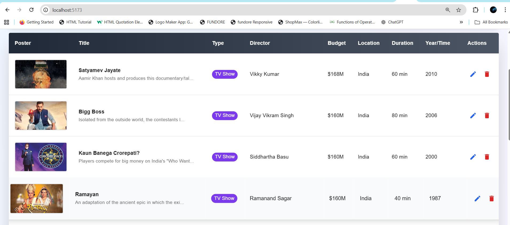
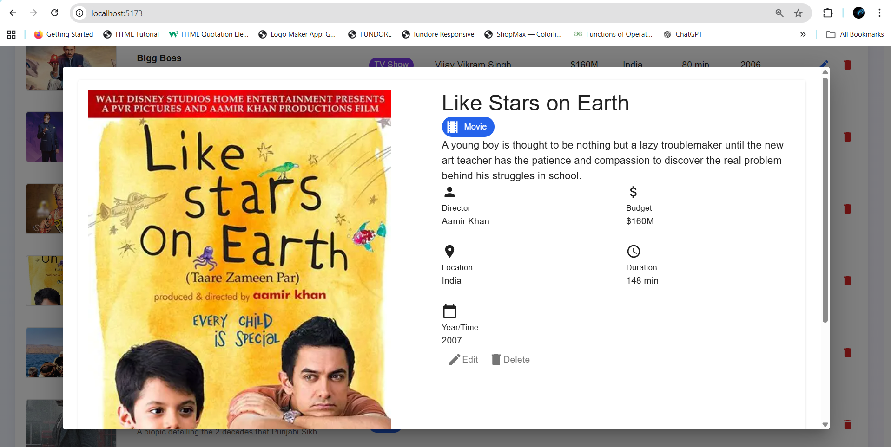

# Movie Management System Frontend (Vite + React + TypeScript + MUI + Tailwind CSS)

Frontend for the Movie Management System. Built with Vite, React, TypeScript, Material UI (MUI) and Tailwind CSS. Connects to the Express backend (../server) to list, add, edit, and delete media items with poster uploads.

## Highlights — Functionality & Features

- List of Movies, TV Shows with Infinite scroll list of media using Intersection Observer for incremental loading.
- Search and basic filtering on the media list.
- Add new media with multipart/form-data (poster upload) and client-side image preview.
- Edit media including replacing poster images.
- Delete media with confirmation modal.
- Client-side validation and error display.
- Centralized API service (src/services/api.ts) for easy backend base URL configuration.
- Reusable hook (src/hooks/useMedia.ts) that supports fetching, infinite loading, create, update, and delete operations.
- UI built with MUI components and styled with Tailwind CSS for utility styling and responsive layout.

## Requirements

- Node 18+ (Windows supported)
- Backend server running and reachable (see ../server)

## Quick start

1. Install dependencies
```sh
cd movie_mgmt_system
npm install
```

2. Run development server
```sh
npm run dev
```
Open the URL printed by Vite (usually http://localhost:5173).

## Configure backend API URL

Set the backend base URL in:
- src/services/api.ts

Or create a .env with:
VITE_API_BASE=http://localhost:5000/api

Ensure the backend CORS allows the frontend origin (CLIENT_URL in server .env).

## Expected backend endpoints

Frontend expects the server API under the configured base (example base + endpoints):

- GET  /media?page=1&limit=10   — list (used by infinite scroll; returns paginated chunk)
- GET  /media/:id               — get single item
- POST /media                   — create (multipart/form-data)
- PUT  /media/:id               — update (multipart/form-data)
- DELETE /media/:id             — delete

Note: Poster images are served by the backend under /uploads/...

## Project structure (important files)

- index.html — Vite entry
- src/main.tsx — app bootstrap
- src/App.tsx — app layout / routes
- src/components/
  - MediaTable.tsx — infinite-scroll list & row actions (edit/delete)
  - MediaForm.tsx — create/edit form with file input & preview
  - DeleteConfirmation.tsx — confirmation modal
- src/hooks/
  - useMedia.ts — fetch + infinite loading + CRUD functions
- src/services/
  - api.ts — axios instance and base URL
- src/types/
  - media.ts — Media type definitions
- src/index.css / App.css — Tailwind + custom styles
- tailwind.config.js — Tailwind setup
- vite.config.ts — Vite config (env handling)

## Implementation notes

- Infinite scroll: implemented with an Intersection Observer that triggers loading next page chunk when bottom sentinel appears. The hook merges results and tracks hasMore/loading/error state.
- MUI + Tailwind: MUI components are used for structure (tables, dialogs, form controls) and Tailwind utilities for spacing, layout and responsive tweaks.
- File uploads: MediaForm sends multipart/form-data; backend should return media objects including an image_url. Use the backend full URL to render images.
- Error handling: API errors surfaced in UI; use browser devtools network tab and server logs for troubleshooting.

## Troubleshooting

- CORS errors: ensure backend CLIENT_URL / CORS config includes the frontend origin.
- Images not loading: verify backend serves uploads statically and image_url is correct.
- Wrong API base: update src/services/api.ts or set VITE_API_BASE in .env.

## Screenshots



